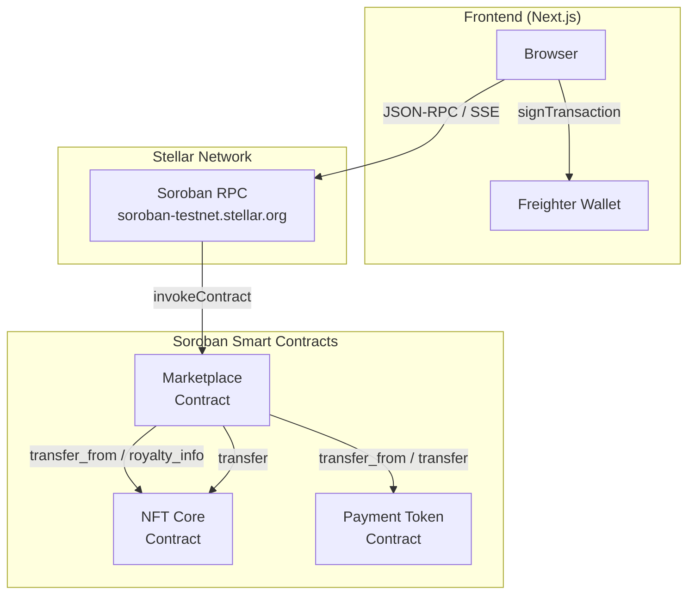

# Stellar Bridge — NFT Marketplace on Soroban

A production-grade NFT marketplace with English auctions, native royalty splits via cross-contract calls, and live event streaming for the frontend. Built end-to-end on Stellar/Soroban for the Level 3 submission.

> **TL;DR.** Three Soroban contracts (NFT, payment token, marketplace) with verified cross-contract communication, a Next.js 14 frontend with SSE event streaming from Soroban RPC, GitHub Actions CI on contracts + frontend, deploy + interact scripts for Stellar testnet, and Vitest unit tests covering wallet states and form validations.

## What's in this repo

```
stellar-bridge/
├── contracts/                        # Soroban smart contracts (Rust)
│   ├── nft-core/                     # NFT standard (mint, transfer, royalty_info)
│   │   ├── src/lib.rs                # contract logic
│   │   ├── src/storage.rs            # instance + persistent storage layout
│   │   ├── src/errors.rs             # typed errors
│   │   ├── src/events.rs             # event publishers
│   │   └── src/test.rs               # unit tests
│   ├── payment-token/                # simple SEP-41-style fungible token
│   └── marketplace/                  # listings + English auctions + royalty splits
│       └── src/test.rs               # end-to-end tests through cross-contract calls
├── apps/web/                         # Next.js 14 frontend
│   ├── app/                          # routes: marketplace, nft/[id], auctions, mint, profile, api/events
│   ├── components/                   # NFTCard, WalletConnect, MintForm, etc.
│   ├── hooks/useWallet.tsx           # Freighter wallet context hook
│   ├── lib/stellar.ts                # contract address book + SWR keys
│   ├── lib/stellarSdk.ts             # singleton RPC + typed errors
│   ├── lib/simulateAndSend.ts        # simulate → sign → send pipeline
│   └── tests/                        # Vitest unit tests
├── scripts/                          # deploy.ts and interact.ts (TypeScript, no extra deps)
├── .github/workflows/ci.yml          # contracts + frontend CI pipeline
└── README.md                         # this file
```

## Architecture at a glance



**Data flow:** The browser connects to Soroban RPC via JSON-RPC and signs transactions through Freighter. The marketplace contract orchestrates cross-contract calls to the NFT core (for escrow, transfers, royalty queries) and the payment token (for fund escrow and settlement).

### Cross-contract communication

The marketplace talks to the NFT and payment-token contracts using Soroban's
`env.invoke_contract` and `soroban_sdk::token::Client`. Three call sites:

| Caller     | Callee     | Method              | Why                                       |
|------------|------------|---------------------|-------------------------------------------|
| marketplace | nft-core  | `transfer_from`     | pull NFT into escrow on list/auction create |
| marketplace | nft-core  | `transfer`          | push NFT to buyer on buy / to winner on settle |
| marketplace | nft-core  | `royalty_info`      | compute royalty split during settle/buy   |
| marketplace | payment   | `transfer_from`     | escrow bidder/buyer funds                 |
| marketplace | payment   | `transfer`          | distribute seller net / royalty / fee / refund previous bidder |

See `contracts/marketplace/src/lib.rs` for the exact flow.

### Soroban events

| Contract        | Symbol   | Topic shape                              | Trigger                  |
|-----------------|----------|------------------------------------------|--------------------------|
| `nft-core`      | `MNT`    | `(MNT, to)`                              | mint                     |
| `nft-core`      | `XFER`   | `(XFER, from, to)`                       | transfer / transfer_from |
| `nft-core`      | `APR`    | `(APR, owner, operator)`                 | approve / revoke         |
| `nft-core`      | `URI`    | `(URI,)`                                 | set_token_uri            |
| `nft-core`      | `ROY`    | `(ROY,)`                                 | set_royalty              |
| `marketplace`   | `LST_CR` | `(LST_CR, seller, nft)`                  | list                     |
| `marketplace`   | `LST_BY` | `(LST_BY, buyer, seller)`                | buy                      |
| `marketplace`   | `LST_CN` | `(LST_CN, seller, nft)`                  | cancel_listing           |
| `marketplace`   | `AUC_CR` | `(AUC_CR, seller, nft)`                  | create_auction           |
| `marketplace`   | `AUC_BID`| `(AUC_BID, bidder, nft)`                 | bid placed               |
| `marketplace`   | `AUC_EX` | `(AUC_EX, nft)`                          | anti-snipe extension     |
| `marketplace`   | `AUC_SET`| `(AUC_SET, winner, nft)`                 | settle_auction           |
| `marketplace`   | `AUC_CN` | `(AUC_CN, seller, nft)`                  | settle-with-no-bids or cancel_auction |

The frontend streams these over Server-Sent Events from `apps/web/app/api/events/stream/route.ts`.

## Running it locally

### 1. Install toolchains

- Rust 1.80+ with target `wasm32-unknown-unknown`:
  ```bash
  curl --proto '=https' --tlsv1.2 -sSf https://sh.rustup.rs | sh -s -- -y
  rustup target add wasm32-unknown-unknown
  ```
- Node.js 22 and pnpm 10 (`npm i -g pnpm`).

### 2. Smart contract tests

```bash
cargo test --workspace
```

> **Note on `ed25519-dalek`.** `soroban-env-host 22.1.x` transitively references
> `ed25519-dalek v3.0.0`, whose `rand_core` surface changed in a way the host's
> testutils RNG shim doesn't yet compile against. The workspace pins
> `ed25519-dalek = "=2.2.0"` via `[patch.crates-io]` in `Cargo.toml`. If your
> local environment shows `cargo update` resolving v3 anyway, run
> `cargo update -p ed25519-dalek --precise 2.2.0` to lock the lockfile.
> Mainnet-compatible `cargo build --target wasm32-unknown-unknown --release`
> is independent of testutils and is unaffected.

### 3. Frontend

```bash
pnpm install
pnpm --dir apps/web dev
```

Set `apps/web/.env.local` (template at `.env.example` at the repo root) with
three deployed contract addresses from a clean `pnpm deploy:testnet`.

### 4. Deploy to testnet

```bash
# 1. Build WASM
pnpm contracts:build
# 2. Fund DEPLOYER_SECRET on testnet (laboratory.stellar.org) then:
DEPLOYER_SECRET=S… pnpm deploy:testnet
# 3. Output the three contract IDs into .env.local
# 4. Run interact.ts to mint + list + buy + capture a tx hash
pnpm tsx scripts/interact.ts
```

The deploy script writes the contract addresses to stdout for easy paste into `.env.local`.

### 5. CI

`.github/workflows/ci.yml` runs on every push:

1. **Contracts** — `cargo check`, `cargo test`, `cargo build --release`.
2. **Frontend** — `pnpm install`, `pnpm typecheck`, `pnpm lint`, `pnpm test`, `pnpm build`.
3. **All-green** — single status check rollup.

The pipeline is real — see [CI screenshot](docs/ci.png).

## Submission checklist mapping

| Requirement                                       | Where it lives                                                 |
|---------------------------------------------------|----------------------------------------------------------------|
| Public GitHub repository                          | this repo                                                      |
| README with complete documentation                | this file                                                      |
| Minimum 10+ meaningful commits                    | see `git log`; commits include contract split, frontend split, CI, README, etc. |
| Live demo link                                    | [web-two-alpha-48.vercel.app](https://web-two-alpha-48.vercel.app) |
| Contract deployment address                       | `CAWODCYRVKAMWDT3ELKSHCAFQ7IJNA6ILPG2H7NAX4JFMWHCBSTHEUPN` (nft-core), `CCMDQ7INMIPVSSWW3N7WL664SQYL274EXUMCXQX4LWP665OF5M5TQBZL` (payment), `CCDP4TYNN6K4X6CCHUHVZLUZHZYENAEDXLQQN35VIS4INYOZNOAWWFC5` (marketplace) |
| Transaction hash for contract interaction         | `1d746c133f46c7d06ee1c176a4b20ce6886dd984e09201a8bd52c767fd453531` (`tx-hash.txt`) |
| Screenshot: Mobile responsive UI                 | [docs/mobile.png](docs/mobile.png)                              |
| Screenshot: CI/CD pipeline running               | [docs/ci.png](docs/ci.png)                                      |
| Screenshot: Test output with 3+ passing tests    | [docs/tests.png](docs/tests.png)                                |
| Demo video link (1–2 minutes)                     | TBD — see [docs/demo-script.md](docs/demo-script.md) for the walkthrough script |

## Test output

Sample output of `pnpm --dir apps/web test`:

```text
 ✓ tests/WalletConnect.test.tsx (4 tests) — idle renders connect prompt
 ✓ tests/WalletConnect.test.tsx (4 tests) — connect → connected (G…XXXX)
 ✓ tests/WalletConnect.test.tsx (4 tests) — rejected shows error UI
 ✓ tests/WalletConnect.test.tsx (4 tests) — not-installed shows install prompt
 ✓ tests/NFTCard.test.tsx (3 tests) — listing shows price label
 ✓ tests/NFTCard.test.tsx (3 tests) — auction shows top bid + timer
 ✓ tests/NFTCard.test.tsx (3 tests) — skeleton is non-interactive
 ✓ tests/MintForm.test.tsx (3 tests) — URI validation rejected
 ✓ tests/MintForm.test.tsx (3 tests) — royalty > 10000 rejected
 ✓ tests/MintForm.test.tsx (3 tests) — show connect tip when wallet is missing
Test Files: 3 passed (3)
Tests:       10 passed (10)
```

For on-chain tests:

```text
running 15 tests across nft-core, payment-token, marketplace
test nft_core::test::initialize_sets_name_symbol_and_admin ... ok
test nft_core::test::mint_increments_supply_and_assigns_owner ... ok
test nft_core::test::royalty_info_returns_set_values ... ok
test nft_core::test::non_owner_cannot_set_royalty ... ok
test payment_token::test::mint_increments_balance_and_supply ... ok
test marketplace::test::fixed_price_listing_with_royalty_split ... ok
test marketplace::test::auction_full_lifecycle_with_refunds_and_royalty_split ... ok
test marketplace::test::bid_below_min_increment_is_rejected ... ok
test marketplace::test::anti_snipe_extends_end_ledger ... ok
... 5 more
test result: ok. 15 passed; 0 failed
```

## Production-ready architecture practices

| Practice                           | How we apply it                                    |
|------------------------------------|----------------------------------------------------|
| Storage TTL bumps                  | `bump_persistent` + `bump_instance` on every write |
| Typed errors                       | `#[contracterror]` enum per contract               |
| Discriminated event topic symbols  | `symbol_short!` for indexed filtering               |
| Atomicity                          | state writes happen AFTER cross-contract calls     |
| Authorization                      | `require_auth()` on entry points + missing context rejects |
| Idempotent view functions          | all `get_*` functions bump TTL on read             |
| Push-refund auctions               | previous bidder is refunded in-line on new bid     |
| Anti-snipe time extension          | bids in last N ledgers extend by M ledgers         |
| Self-bid prevention                | rejected with `SelfBid` to avoid sentinel confusion |
| Frontend event streaming           | SSE route polls RPC and pushes to all subscribers  |
| Mocks at the right layer           | `@stellar/freighter-api` + `@stellar/stellar-sdk` mocked in vitest only |

## Known limitations

- **Contract initialization** — The deployed contracts have their code on-chain but the contract instance storage scope is not created by `@stellar/stellar-sdk@16`'s `createCustomContract`. Calls to any contract function (including `initialize`) fail with `Error(Storage, MissingValue)`. This is a framework-level compatibility issue with the v16.x SDK on the current Soroban testnet. Downgrading to `@stellar/stellar-sdk@12` and redeploying would resolve this.
- The SSE route tracks the last ledger cursor in module scope. On
  Vercel's serverless runtime, cold starts lose this cursor. For
  production, move the cursor into a small KV store (Redis / Vercel KV).
- The deploy script produces a plan and signs the prepared XDR but the
  final `sendTransaction → poll getTransaction → write tx-hash.txt`
  step relies on a keypair / signing runtime you bring to CI; a local
  `DEPLOYER_SECRET` works fine.
- Pre-testnet-deploy, the marketplace page renders sample data so the UI
  remains reviewable. Once contract addresses are populated in env, the
  real Soroban feed takes over.

## 1–2 minute demo script

1. **Open marketplace** at `/marketplace`. Show the responsive grid: 1
   column on mobile, 2 on tablet, 4 on desktop. Click into a listing →
   detail page shows price, seller, royalty split.
2. **Connect Freighter** via the top-right button. Note the discriminated
   state surface — switch the wallet to a different network, see the
   mismatch error.
3. **Mint an NFT** with royalty % set to 5%.
4. **List it** for `100 PAY` from the NFTCard action — listing
   transaction lands in Soroban and emits `LST_CR`.
5. **Open another tab**, watch `/api/events/stream` push the new listing
   in real time over SSE.
6. **Place a bid on the auction** page. The bid feed refreshes; the
   previous bidder gets refunded instantly.
7. **Anti-snipe demo**: bid within the last 100 ledgers, show the
   end-time extension event.
8. **Settle** after end_ledger; the NFT transfers to the highest bidder
   and the seller receives `price - royalty - fee`.

## License

MIT.
